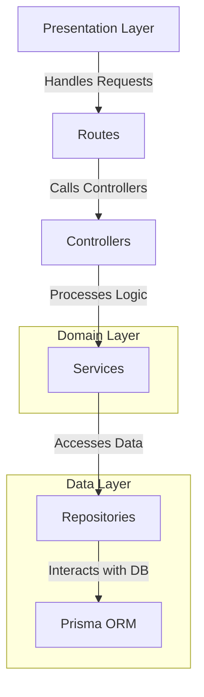
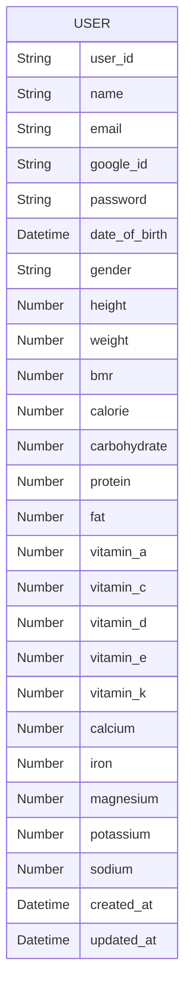

# Skill Test Backend MiniLemon

This is the backend for a note-taking application built with Express.js.

This project follows a clean architecture approach, which aims to separate concerns and create a maintainable and scalable codebase. Here's a brief explanation of the structure:

NOTE: Implementing hard delete as per test requirements.
In a production environment, a soft delete approach (e.g., setting an 'is_deleted' flag or a 'deleted_at' timestamp)
Would be the preferred best practice for data recovery and audit trail purposes.

## Architecture:



### 📁 Project Structure

This project follows a clean and organized structure, ensuring maintainability and scalability. Below is an overview of the main directories and files:

### 📂 Root Directories

- **`api/`** - Entry point for the API, responsible for initializing and configuring the server.
- **`prisma/`** - Contains database schema and migration files.
- **`public/`** - Serves static files used by the application.
  - **`swagger-ui/`** - Assets for API documentation using Swagger UI.
- **`src/`** - Main source code directory.

### 📂 Source Code (`src/`)

#### 🏗️ Architecture Layers

- **`controller`** - Handles HTTP requests and responses.
- **`route`** - Defines API endpoints and connects them to controllers.
- **`service`** - Contains business logic and core application functionality.
- **`repository`** - Manages database operations and interactions.
- **`model`** - Defines data structures and database models.

#### 🔧 Supporting Modules

- **`utils/`** - Utility functions to support the application.
- **`types/`** - TypeScript type definitions for better type safety.
- **`docs/`** - OPEN API documentation.

## 🛠️ Configuration Files

- **`package.json`** - Project manifest file.
- **`tsconfig.json`** - TypeScript configuration file.
- **`vercel.json`** - Configuration for deployment on Vercel.

## 📚 API Documentation

A summary of available endpoints. For complete details, visit **[Swagger Page](http://localhost:8080/api-docs/)**.

**Base URL:** `hhttps://itase-6.vercel.app/api`

## Getting Started

### Prerequisites

- Node.js
- npm

### Installation

1. Clone the repository:

```sh
git clone https://github.com/christian-siahaan26/itase-6
```

2. Navigate to the project directory:

```sh
cd itase-6
```

3. Install dependencies:

```sh
npm install
```

### Database Setup

#### ERD



1. Migrate prisma database:

```sh
npx prisma migrate dev
```

### Running the Server

1. Start the development server:

```sh
npm run dev
```

## Contributing

Contributions are welcome! Please open an issue or submit a pull request.

## License

This project is licensed under the MIT License.
